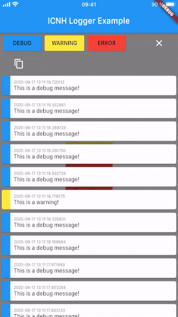

# ICNH Logging Tool

A logging tool for Flutter projects.

## Usage

To log a message:
```dart
import 'package:icnh_logger/icnh_logger.dart';

log.debug('...');
log.warn('...');
log.error('...');
```

Best used with `avoid_print` in your `analysis_options.yaml`.
```yaml
linter:
  rules:
    - avoid_print
```

To show the InApp-Logger use the `LogView` Widget:

```dart
bool _showLog = false;

@override
Widget build(BuildContext context) {
    return Scaffold(
        appBar: AppBar(title: Text('ICNH Logger Example')),
        body: Stack(
        children: [
            Center(child: Text('Hello World!')),
            
            if (_showLog)
                LogView(
                    onClose: () => setState(() => _showLog = false),
                ),
            ],
        ),
    );
}
```

## Example


